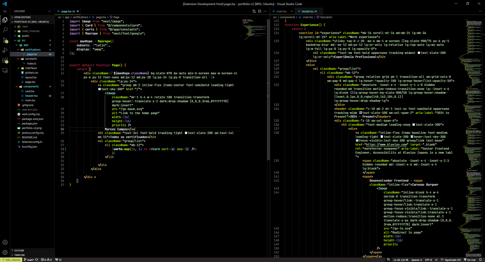
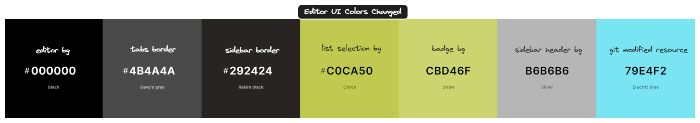
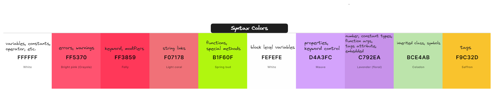

  

<h1 align="center">
Hypernova Theme
</h1>

A minimal dark theme for VSCode based on <a href="https://github.com/morhetz/gruvbox">GruvBox theme</a>.

    

## Installation via VS Code

1. Open **Extensions** sidebar panel in VS Code. `View → Extensions`
2. Search for `Hypernova`
3. Click **Install** button to install it
4. Click **Reload** button to reload the editor
5. Choose the theme following the step: 
    * `Code > Preferences > Color Theme > Hypernova`

## Manual Installation

Read the [VSC Extension Quickstart Guide](vsc-extesion-quickstart.md)

## Color Pallete

## References

All those references was extracted from Visual Studio API.

- [Semantic Guide](https://code.visualstudio.com/api/language-extensions/semantic-highlight-guide)
- [TextMate Grammar](https://macromates.com/manual/en/language_grammars)
- [Syntax Highlight & TextMate Grammar Guide](https://code.visualstudio.com/api/language-extensions/syntax-highlight-guide)
- [Extension Publishing Guide on VSCode Marketplace](https://code.visualstudio.com/api/working-with-extensions/publishing-extension)
- [Theme Color Guide](https://code.visualstudio.com/api/extension-capabilities/theming)

## Donate

If you want to contribute with my effort, i would apreciate, thanks for your kind. This is a qr code for my <a href="https://www.bcb.gov.br/estabilidadefinanceira/pix" style="font-weight: bold;">PIX</a>

  

## License

[MIT](https://en.wikipedia.org/wiki/MIT_License)